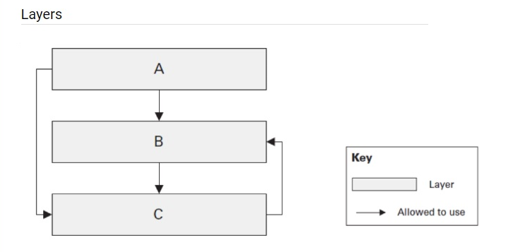

# .NET Mentoring Program Advanced

## Layered Architectures

### Extensibility of ECommerce app

**Task 1**

  Unfortunately, even when using Clean Architecture with physical layer separation, I was not able to achieve full isolation and modularity.
  In Task 1 of my Cart project, I used a NoSQL LiteDB database for data persistence. LiteDB operates only synchronously, so I designed the CartService with synchronous behaviour. This means that if I decide in the future to switch to a SQL database and an ORM such as Entity Framework, which supports asynchronous operations, I would need to redesign the service from synchronous to asynchronous.
  Another potential cost in the future is the absence of the Unit of Work pattern, which is often used together with the Repository pattern. LiteDB does not track entity state, so introducing Unit of Work in this case would not bring any value. However, if I later switch to a database that does support state tracking, introducing the Unit of Work pattern might become necessary, requiring changes to the CartService logic.
  Moreover, if I switch from LiteDB to SQL Server and Entity Framework, the Repository and Unit of Work patterns may become unnecessary and could introduce additional overhead without adding value, since DbContext and DbSet in Entity Framework already act as implementations of these patterns.

**Task 2**

  In Task 2, information from the Infrastructure layer “leaked” into the Application layer because I used Entity Framework with a SQL database. The Application layer needs to be aware of EF DbSets in order to implement the IApplicationDbContext interface.
  This is a well-known pitfall of Clean Architecture. To avoid it, I could introduce the Repository and Unit of Work patterns. However, as mentioned previously, this would largely duplicate Entity Framework’s built-in functionality and may not provide significant additional value.
  Therefore, the IApplicationDbContext interface could be considered a potential candidate for future refactoring and redesign.

### Questions with answers

**1.	Name examples of the layered architecture. Do they differ or just extend each other?**

  Examples of layered architecture include N-tier architecture, Clean Architecture, Onion Architecture and Hexagonal Architecture.
  These architectures represent the same core idea: separation of concerns. This is achieved through both physical and logical separation of layers, typically including the Presentation layer, Business Logic layer and Data Access layer.
  All of these architectures build upon and refine this concept rather than fundamentally differing from it.

**2.	Is the below layered architecture correct and why? Is it possible from C to use B? from A to use C?**
   

  The presented layered architecture is not correct. One of the main principles of layered architecture is that layers should be closed. This means that communication flow is strictly defined and should not be chaotic.
  For example, the Presentation layer should not communicate directly with the Data Access layer while bypassing the Business Logic layer. In the provided diagram, this principle is violated.

**3.	Is DDD a type of layered architecture? What is Anemic model? Is it really an antipattern?**

  DDD is not a layered architecture. It is an approach that focuses on how the Domain layer should be designed.
  An Anemic Domain Model is a pattern in which domain entities contain only data and no behaviour.
  Whether it is an antipattern is still debated. While it was widely considered an antipattern in the past, today it is sometimes viewed as a valid design choice in certain contexts.
  However:
  It does violate core OOP principles and It does not align well with DDD, where behaviour is expected to reside within domain models.

**4.	What are architectural anti-patterns? Discuss at least three, think of any on your current or previous projects.**

  An architectural anti-pattern is a design decision that may initially seem like a good solution but leads to significant problems over time.

  God Object
  This occurs when too much complex behaviour is concentrated in a single object. It is common in long-lived systems, where objects tend to grow over time. Although it signals the need for refactoring, this is often difficult in legacy systems due to risk and complexity.

  Magic PushButton
  This anti-pattern represents layer leakage, where the frontend is too tightly coupled with backend logic. This leads to poor separation of concerns, making the system harder to maintain and test. It is often seen in projects with less experienced developers.

  Copy-Paste Programming
  This involves duplicating code instead of reusing it properly. It increases complexity and maintenance costs, as changes must be applied in multiple places. Over time, it can result in an unmaintainable system.

**5.	What do Testability, Extensibility and Scalability NFRs mean. How would you ensure you reached them? Does Clean Architecture cover these NFRs?**

  Testability refers to how easily a system’s functionality can be tested. It can be achieved through proper abstraction (interfaces), reduced complexity and following to the Single Responsibility Principle.
  Extensibility refers to how easily new features can be added. Applying SOLID principles and maintaining good layer isolation supports modular design and improves extensibility.
  Scalability describes how well a system performs under increasing load. It can be improved through modular design, asynchronous communication and distributed architectures such as microservices.
  Clean Architecture does not fully guarantee these non-functional requirements, but it strongly supports them. By promoting clear separation of concerns and strong abstraction, it creates a solid foundation for achieving testability, extensibility and scalability.